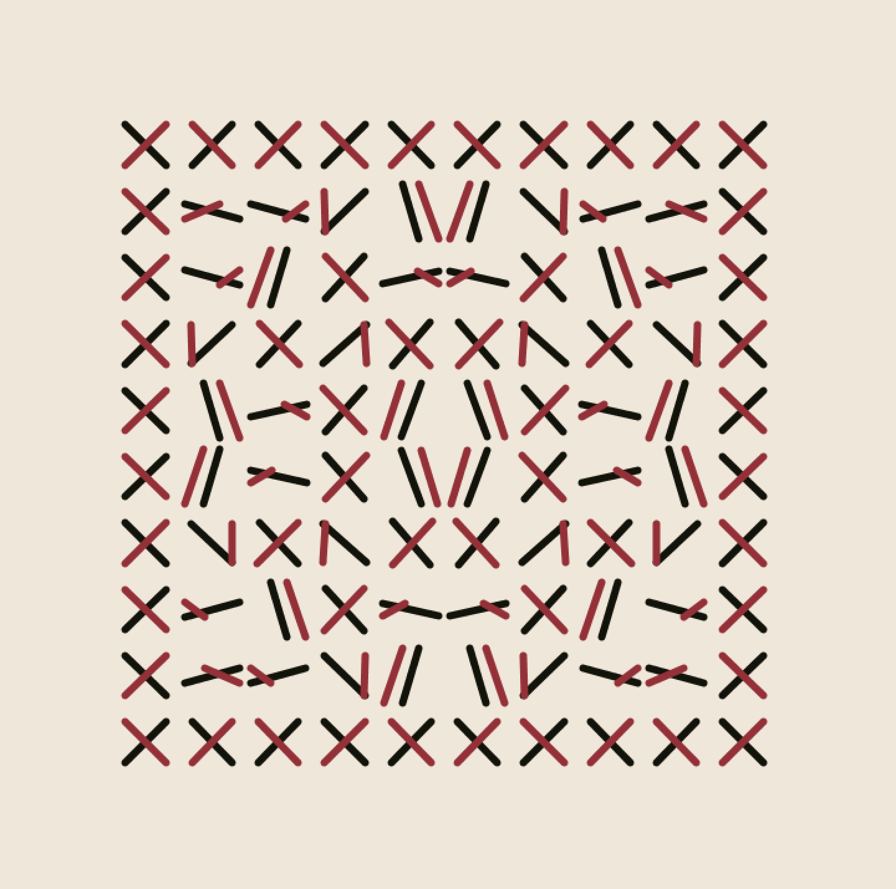

# Précis: 
*generative, iterative, anti-narrative, anti-figurative, commiserative, curative... art?*   
    
- a record of teaching my computer to draw
- after constantly running out of storage, this repo will serve as a digital sketchbook 
- most pieces draw inspiration from other works and artists, and I've linked the originals! 
- everything here is made with [Processing.py](https://py.processing.org/)
- note that modifications must be Jython-friendly (no numpy, no f-strings, etc.)
- with default setup (no command line), all `.py` files should be run as `.pde` files
- `IMAGEMAGICK` is used to convert stack of `.png's` to `.gif's`
    
<!-- - there are directions to get things running on any IDE, MUST be on version 1.8.0_202 of Java ... -->
 
## The Art of Conversation \[[original](http://imagespoetrysilence.blogspot.com/2018/01/the-art-of-conversation-by-rene.html)\]  
### RENÉ MAGRITTE  
  
  

:open_file_folder: `magritte/`

## Blobules \[[inspiration](https://twitter.com/kGolid/status/1279204707618209793)\]
### KJETIL GOLID

:open_file_folder: `blobule/`

## Mobile Rouge Sur Blanc \[[original](https://www.artsy.net/artwork/julio-le-parc-mobile-rouge-sur-blanc-1)\]  
### JULIO LE PARC 
   

  

:open_file_folder: `squa[red]/`

## Rotation in Red and Black \[[original](https://www.metmuseum.org/art/collection/search/815338)\]  
### JULIO LE PARC  

:open_file_folder: `xxx/`

<!-- ## The Red Act  

:open_file_folder: `redact/` -->