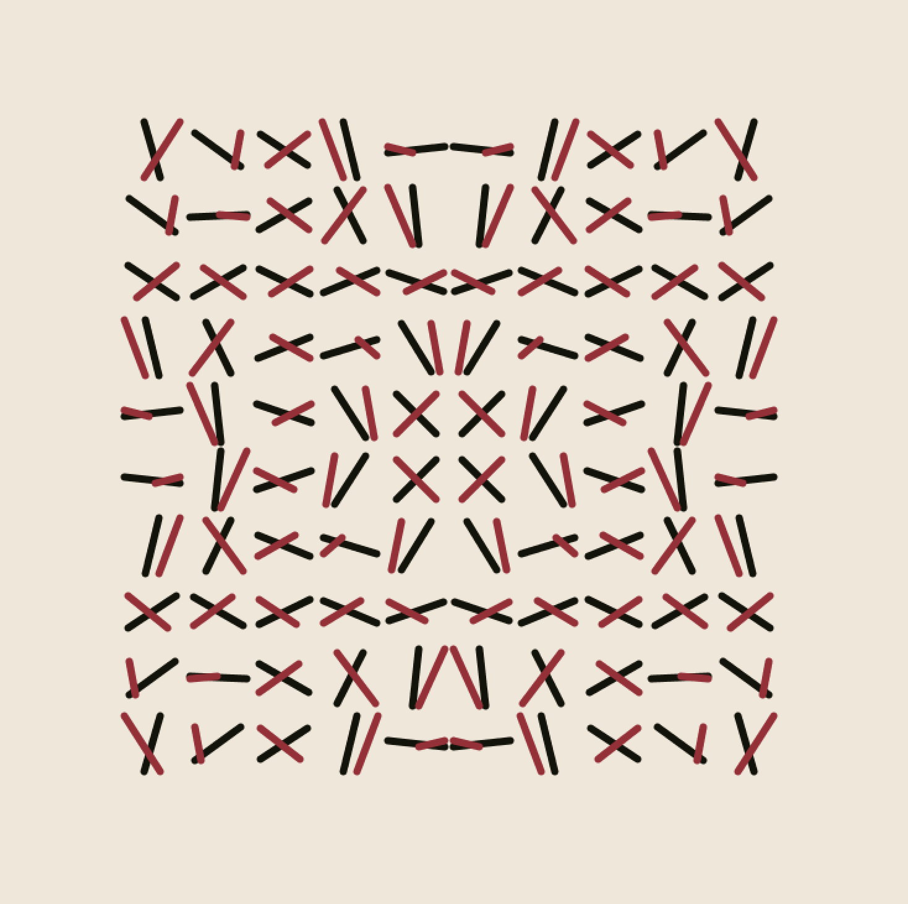
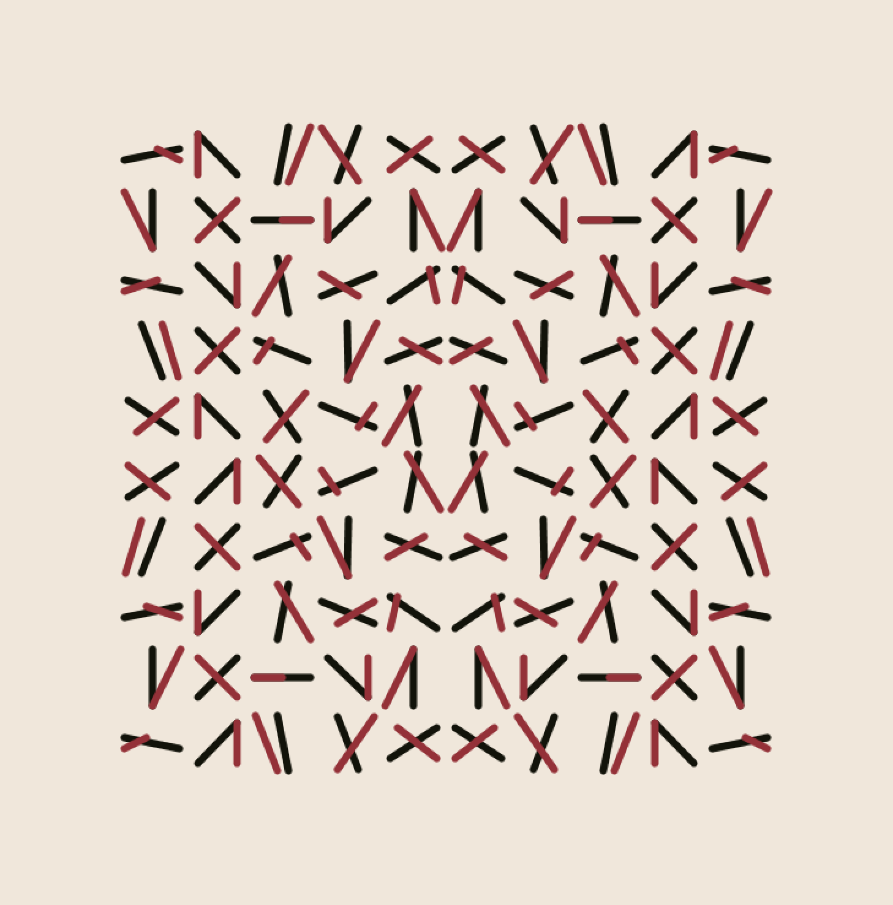
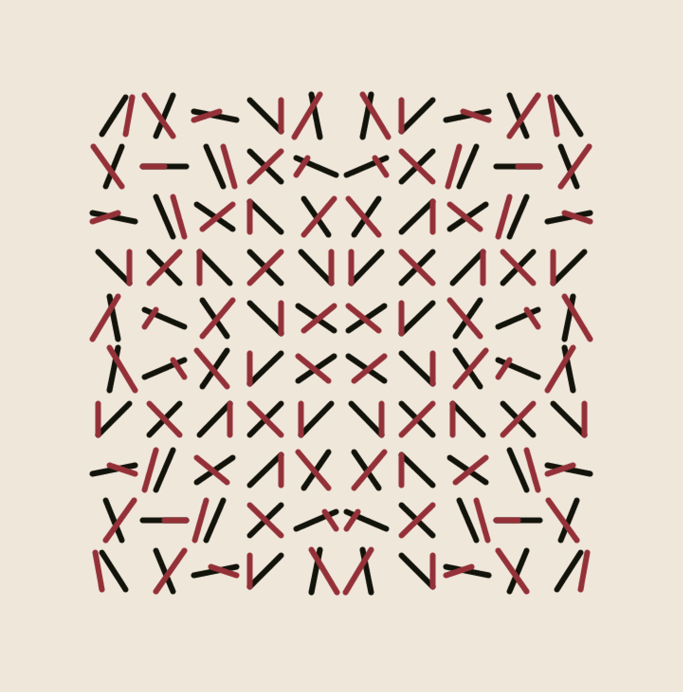
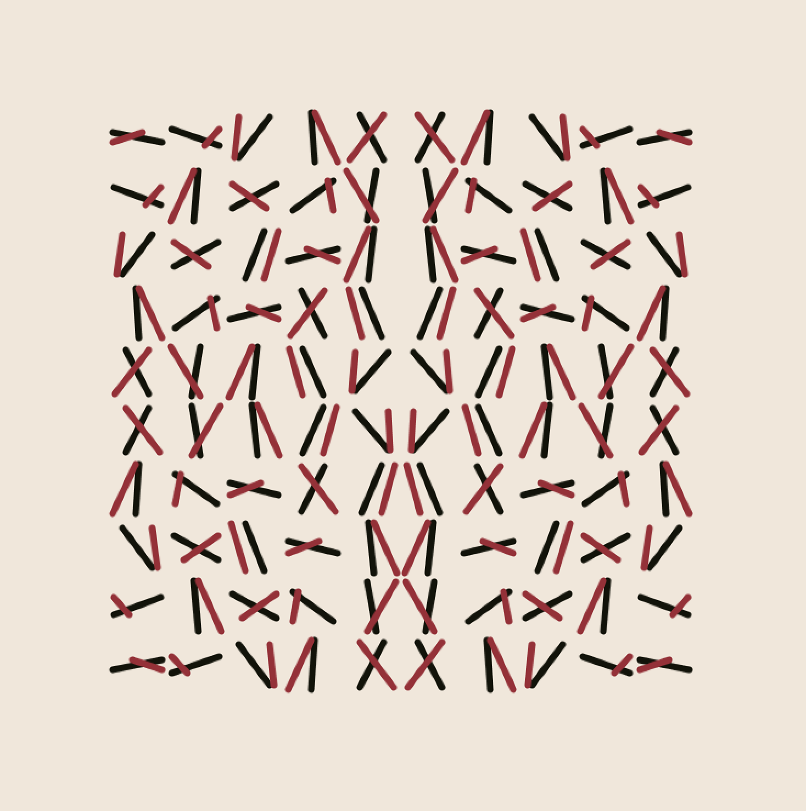
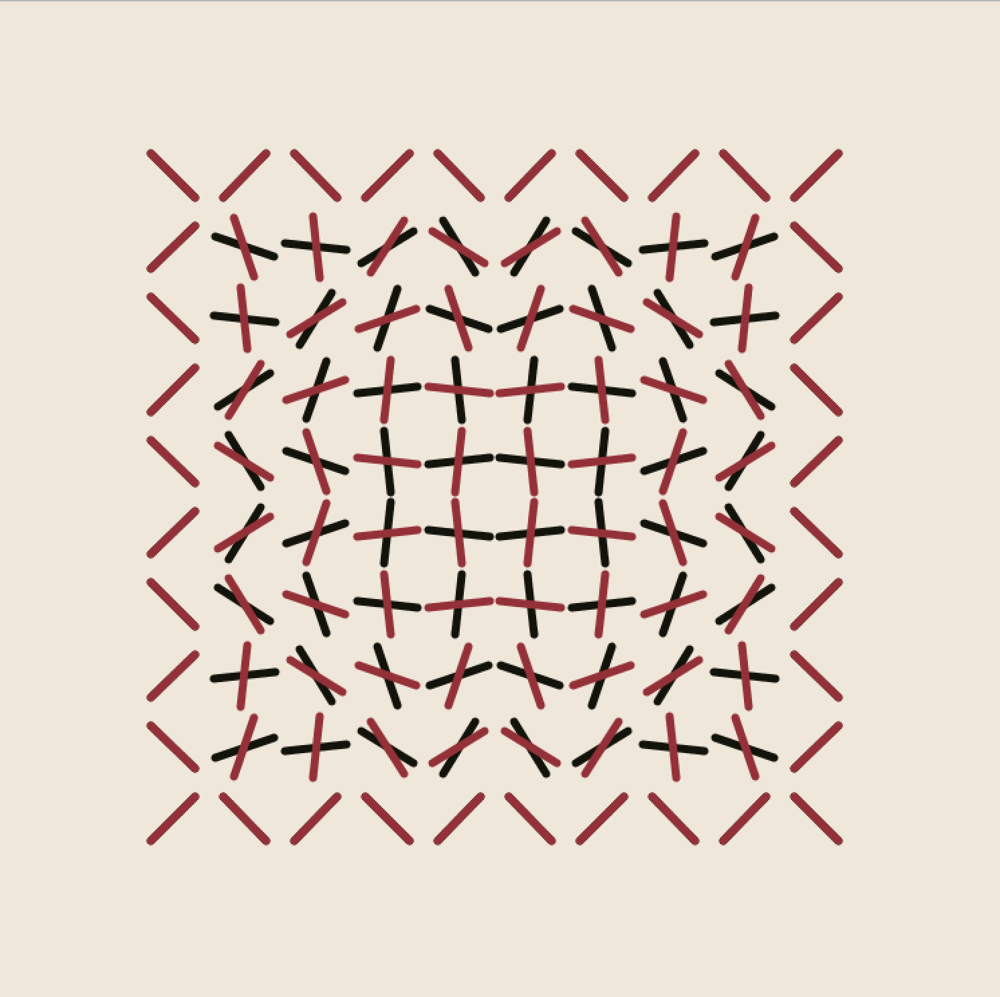
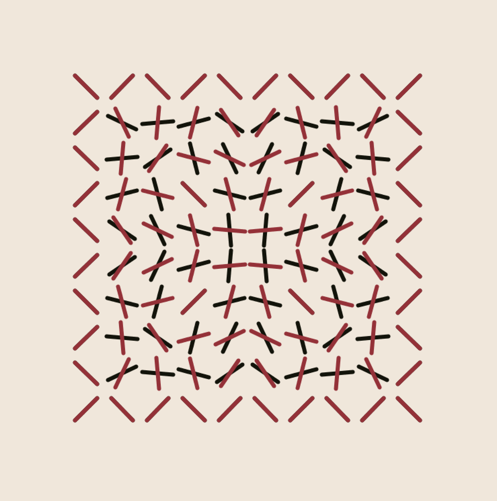
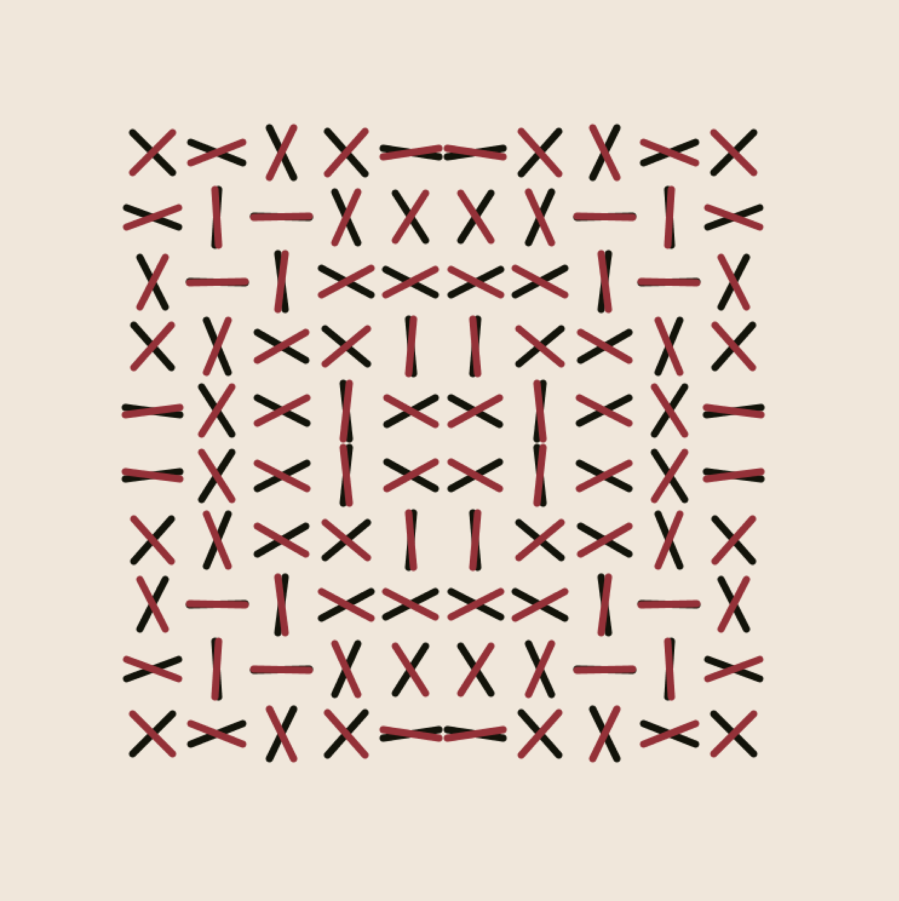
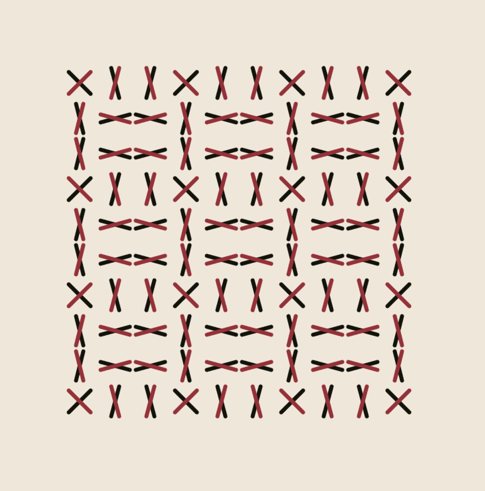

# variations
<!-- {:height="70%" width="70%"}
{:height="70%" width="70%"}
{:height="70%" width="70%"}
{:height="70%" width="70%"}
{:height="70%" width="70%"}
{:height="70%" width="70%"}
{:height="70%" width="70%"}
{:height="70%" width="70%"}
{:height="70%" width="70%"} -->

